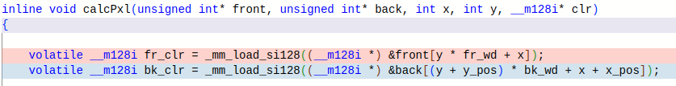
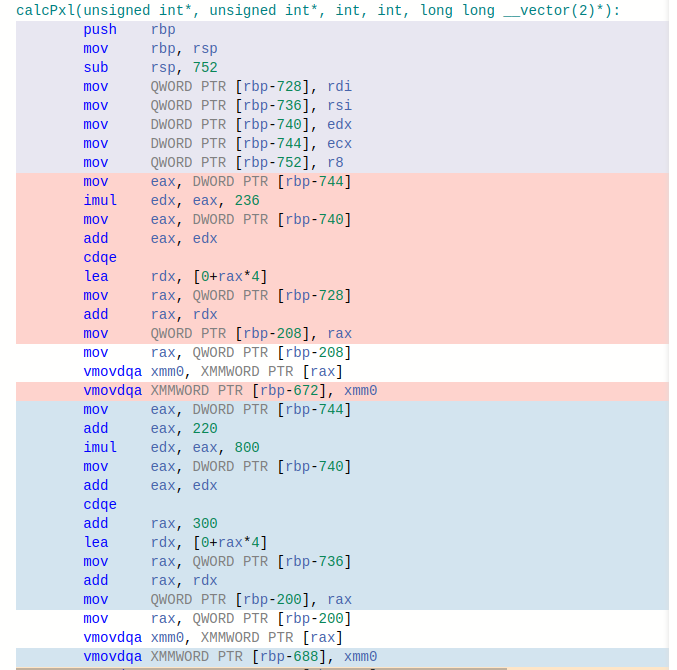
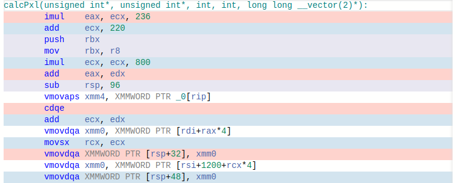

# Alpha Blending
## Project Descrtiption 

This project is a C++ program that utilizes the SFML library for image processing. Specifically, it implements alpha blending of two images using SIMD SSE instructions for improved performance.


## Advantages of using SIMD SSE
SIMD (Single Instruction, Multiple Data) is a technique that allows a single instruction to be executed on multiple pieces of data at the same time, thus improving performance. SSE (Advanced Vector Extensions) is a specific implementation of SIMD that allows for 128-bit vectors to be processed at once.

In our program, we use SSE instructions to perform alpha blending of two images. The SSE instructions allow us to perform the same blending operation on multiple pixels at the same time, resulting in a significant speedup compared to non-SIMD implementations.

While compiler optimization flags such as -Ofast and -O3 can improve program performance, they may not always be able to take advantage of specific hardware features like SIMD. In contrast, using SIMD SSE instructions allows for more precise control over how data is processed, resulting in potentially greater performance gains.

Additionally, compiler flags can sometimes result in unintended consequences, such as changes to program behavior or increased memory usage. By using explicit SIMD instructions, we can ensure that our program behaves exactly as intended.

## Dependencies

This program requires SFML to be installed on your system. You can download SFML from the official website: https://www.sfml-dev.org/download.php

## Build and run

First of all, download this repository:
```bash
git@github.com:mr-gukas/MyALphaBlending.git
cd MyALphaBlending
```
Then you can choose the branch you want:
```bash
git checkout avx    \\ for version with SSE 
git checkout no_avx \\ for version without SSE 
```
Compile the program using CMake: 
```bash
mkdir build 
cd build 
cmake ..
make
```
Run the program:
```bash 
./alpha <front_path> <back_path> <x_pos> <y_pos> 
```

You can also choose on of compiler optimization flags. Write them in "CMakeLists.txt". For example:
```bash
add_compile_options(-Ofast)
```
## Results

**FPS rate:**

| Optimization key | WITHOUT SSE      | WITH SSE    | ACCELERATION FACTOR |
|------------------|------------------|-------------|---------------------|
|       None       |        9         |      31     |         3.4         |
|       -O2        |        32        |      140    |         4.7         |

## Why you should still use compiler optimization flags

When using SIMD instructions without compiler optimization flags, it is possible for the program's execution time to increase due to additional overhead caused by inefficient use of the SIMD registers.
This can be seen by looking through the assembler code of a fragment of our program with the help of the service https://godbolt.org/.
|  |
|:--:|
| <b>fragment of program</b>|

Let's see what the assembler will output if only the -mavx2 flag is specified:
|  |
|:--:|
| <b>without complie optimiziation flag</b>|

Now let's compile the same thing, but by specifying the compiler optimization flag -O2:
|  |
|:--:|
| <b>with -O2 flag</b>|

Specifically, using SIMD instructions requires careful management of data alignment and other considerations. If these considerations are not taken into account, the program may incur additional overhead as the data is moved between memory and the SIMD registers. In addition, the use of SIMD instructions can sometimes result in pipeline stalls or other inefficiencies if the instructions are not properly aligned or if the data is not properly packed.

In contrast, compiler optimization flags like -O3, -O2, and -Ofast are designed to improve program performance in a more general sense. These flags can optimize the code generated by the compiler in a variety of ways, including by using SIMD instructions in a more efficient and effective manner. This can help to minimize overhead and ensure that the program executes as quickly as possible.

Overall, it is important to carefully consider the use of SIMD instructions in conjunction with compiler optimization flags when developing programs. While SIMD instructions can be powerful tools for improving program performance, their use must be carefully managed to avoid unnecessary overhead and ensure that the program executes as quickly as possible.

## Conclusion
We observe a speedup of the program by 4.7 times when using SIMD SSE with compiler optimization flags.
By utilizing SIMD SSE instructions in our image processing program, we were able to achieve a significant improvement in performance compared to non-SIMD implementations. This approach offers advantages over relying solely on compiler optimization flags, including greater control over program behavior and potential for greater performance gains.
